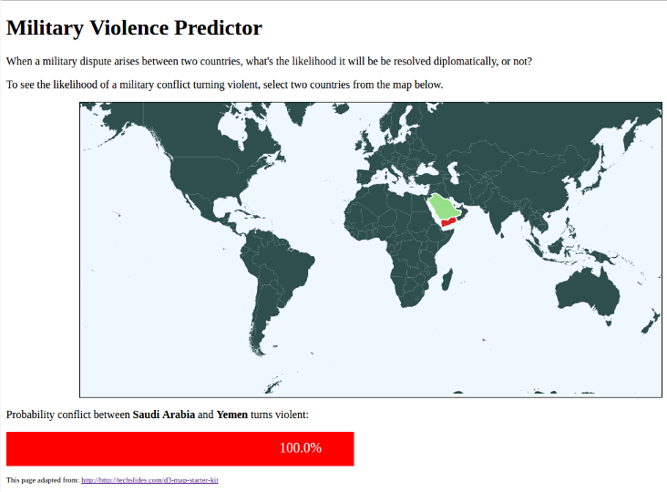

# Predicting military violence

This repository contains the presentation, Jupyter workbooks, and Flask
application I created for the third project in Metis' Data Science
program. The assignment was to use a classification algorithm
to predict outcomes.

Using the [Correlates of War](http://www.correlatesofwar.org/)
data set, I created a Random Forests classifier that predicts whether a
military dispute will turn violent.

The **app** folder contains the code for an interactive web
application I built with D3.js and Flask. It displays a map of the
world and when you select any two countries, it gives you the
probability that, ***IF*** those two countries were involved in a
military dispute, would it be violent?
